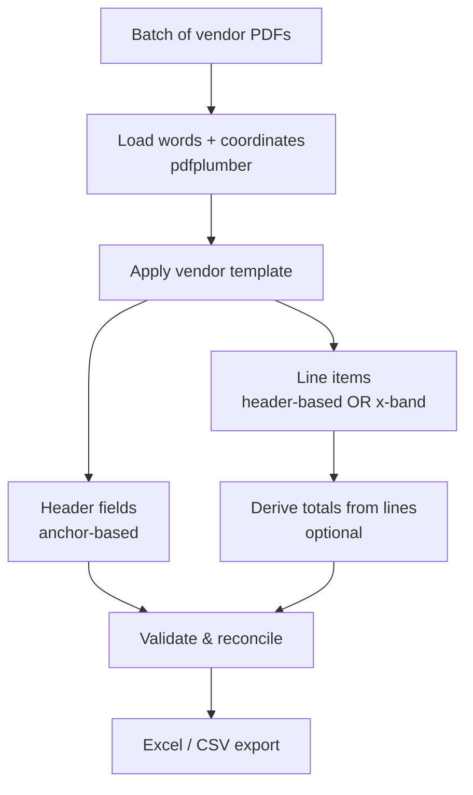
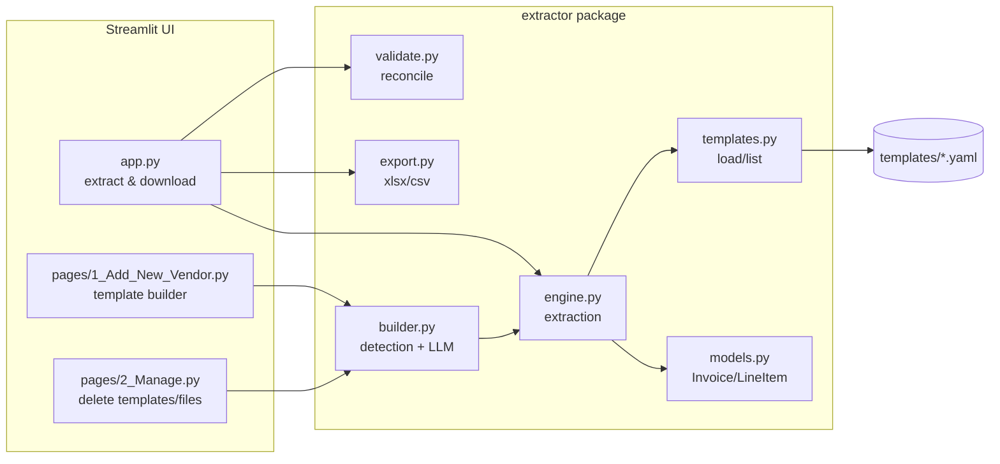

# Invoice → Excel Extractor — Architecture & Developer Guide

A tool that reads **native (text-based) PDF invoices** and turns them into clean
Excel/CSV. It is **template-driven**: you define a small template once per vendor, and
every invoice from that vendor is then extracted automatically. This document explains
how it works, how to install and run it, the template schema, and how to extend it.

> Audience: developers and technical team members who want to install, understand,
> and modify the tool. For the non-technical end-user walkthrough, see `README.md`.

---

## 1. What it does

- Input: one or more native PDF invoices from a single vendor.
- Output: an Excel workbook (two sheets — one row per invoice, one row per line item)
  and/or CSV files.
- Each extracted invoice is **validated** (totals must reconcile) and given a
  confidence score; anything that doesn't add up is flagged for a human.
- New vendors are onboarded through an in-app builder (AI-assisted, click-to-pick, or
  dropdown), or by hand-editing a YAML template.

**Scope / non-goals:** this handles *native* PDFs (selectable text). Scanned/image PDFs
would need an OCR pre-step (see Roadmap). It is intentionally rules-based, not a general
ML parser — see the design rationale below.

---

## 2. Key design decision: template-driven, not ML

For vendors you see repeatedly (many invoices/month), a **deterministic, template-based
rules engine** beats a generic ML/LLM parser on the things that matter here:

| Concern | Template rules (this tool) | Generic ML/LLM parser |
|---|---|---|
| Speed | Milliseconds/page, no network | Slower, network round-trips |
| Accuracy on repeat vendors | Exact & stable | Variable, can drift |
| Cost per invoice | Zero | Per-call cost |
| Debuggability | Fix one rule | Retrain / re-prompt |
| Offline | Yes | Usually no |

The trade-off is a one-time setup per vendor. The **AI assist** in the builder uses an
LLM only to *write the template* from a sample — after that, extraction is pure rules
and runs offline. This gets the best of both: fast reliable extraction, with an LLM to
remove the manual setup effort.

---

## 3. System architecture

### 3.1 Extraction pipeline



### 3.2 Component map



The `extractor` package is a clean, UI-independent library. The Streamlit pages and the
CLI (`run.py`) are thin front-ends over it — you can also `import extractor` and use it
programmatically.

---

## 4. Project structure

```
invoice-extractor/
├── app.py                     # Main Streamlit page: pick vendor, upload, extract, download
├── run.py                     # CLI: process a folder of PDFs against one template
├── make_sample_invoices.py    # Generates sample PDFs for testing
├── Start Invoice Tool.bat     # Windows double-click launcher
├── requirements.txt
├── README.md                  # End-user (non-technical) guide
├── ARCHITECTURE.md            # This document
├── .streamlit/
│   └── config.toml            # Theme, auto-open browser, no email prompt
├── extractor/                 # The core library (no UI code)
│   ├── __init__.py            # Public API surface
│   ├── models.py              # Pydantic models: Invoice, LineItem
│   ├── templates.py           # Load / list vendor templates
│   ├── engine.py              # Extraction engine (the heart)
│   ├── validate.py            # Reconciliation & confidence scoring
│   ├── reconcile.py           # Cross-check extracted values vs totals printed on the PDF
│   ├── classify.py            # Auto-detect which vendor template matches a PDF
│   ├── autotemplate.py        # Build a template from a sample invoice (no AI)
│   ├── rules.py               # Configurable business rules (approval/format checks)
│   ├── dedupe.py              # Duplicate detection + processing history (audit trail)
│   ├── exporters.py           # Tally XML, accounting CSV, JSON exports
│   ├── security.py            # Audit log, PII redaction, AI guardrails, upload checks
│   ├── ui.py                  # Shared theme (large, high-contrast type + menu)
│   ├── export.py              # Excel / CSV writers
│   ├── builder.py             # Field detection, click/preview helpers, LLM generation
│   └── generic.py             # Template-free AI extraction (any invoice → Invoice)
├── pages/                     # Extra Streamlit pages (auto-listed in the sidebar)
│   ├── 1_Add_New_Vendor.py    # Template builder (AI / Point / Pick)
│   └── 2_Manage.py            # Delete templates & generated files
├── rules.yaml                 # Business rules: default + per-vendor profiles
├── security.yaml              # Privacy/security settings
├── SECURITY.md                # Security & privacy documentation
├── templates/                 # ONE YAML per vendor (acme, globex, indigo, ...)
├── sample_invoices/           # Example PDFs
└── output/                    # Generated spreadsheets/CSVs land here
```

---

## 5. The extraction engine (`engine.py`)

The engine reads every word on the page with its bounding box (`x0, top, x1, bottom`)
via pdfplumber, groups words into lines, then applies the template.

### 5.1 Header fields — anchor-based
Each field names an **anchor** (a label printed on the page). The engine finds the
anchor and reads the value to its right. Options per field:

- `max_words` — cap how many words the value can be (useful on crowded lines).
- `gap` — the horizontal gap (points) that ends a value; a value stops when the next
  word is more than `gap` away. Auto-set for fields on crowded lines.
- `nth` — instead of "text to the right", take the *N*-th number to the right of the
  anchor. Ideal for amounts in a totals row and immune to right-alignment gaps.
- `sum_nth` — add several of those numbers (e.g. CGST + SGST + IGST + CESS = total tax).
- `type` — `text`, `date`, `number`, or `money` (see 5.5).
- `occurrence` — which match to use when a label appears more than once: `1` (default),
  `2`, ... or `last`. Essential on receipts where "Subtotal"/"Total" appear both as a
  column heading and as the real totals row.
- `below` — the value sits on the line *below* the label (two-row header tables, common
  on delivery/POS receipts). `below: 2` takes the second line down; `x_tol` controls how
  far left of the label a word may start.
- `before: N` — take the N words immediately *left* of the label (e.g. a store name
  printed before "Placed on" in a footer).

Standalone punctuation after a label (e.g. the `:` in `Number : X`) is skipped
automatically; internal punctuation (the `-` in `6E - 6348`) is preserved.

### 5.2 Crowded lines — gap-based segmentation
On a line packing several fields (`PNR : ... Flight No : ... From : ...`), words inside
one field sit ~2pt apart while there's a much larger gap (~25pt) before the next field's
label. The engine (and the builder) split such lines at those large gaps, so each field
is captured independently. The measured gap is also used to set each field's `gap` so
extraction stops cleanly at the field boundary.

### 5.3 Line items — two strategies
- **Header-based** (`header_anchor` + column `header` words): for simple tables with
  clear single-word column headers. Columns are located by their header word's x-range.
- **Coordinate band (x-band)** (`x_min`/`x_max` per column): for dense tables with
  multi-row headers and cells whose text/numbers wrap across lines (e.g. GST invoices).
  The engine groups words into rows with a `row_tol`, assigns each to a column by x, and
  merges description-only "continuation" lines into the row above.

### 5.4 Deriving totals from line items
For dense tables where the totals row is unreliable (numbers wrap), define
`derive_totals` to compute invoice totals by summing line columns:
```yaml
derive_totals:
  subtotal: {sum: line_total}       # sum a column across all lines
  total:    {sum: amount}
  tax:      {diff: [total, subtotal]}  # subtract two already-computed fields
```

### 5.5 Type conversion
- `text` — kept as printed.
- `date` — normalised to `YYYY-MM-DD` when recognised (day-first for numeric dates like
  `15/06/2026`); if unrecognised, the original text is kept (never lost).
- `number` / `money` — parsed to a float; `money` also strips currency symbols/commas.

### 5.6 Validation (`validate.py`)
- Presence checks on key fields (invoice number, date, total).
- Reconciliation: line amounts must sum to the **subtotal or total** (either convention
  accepted); and `subtotal + tax ≈ total`.
- Produces `validation_ok`, human-readable `validation_notes`, and a `confidence` score.
  Flagged invoices are highlighted in the Excel output.

### 5.6b Reconciliation vs the PDF (`reconcile.py`)
Validation checks a single invoice is *internally* consistent. Reconciliation adds an
*independent* cross-check against the original document: it re-reads the totals **printed
on the PDF** (grand total, subtotal, and derived tax) and compares them to the extracted
figures, and also checks that the sum of the extracted line totals equals the printed
grand total — which catches a missed or misread line even when the arithmetic otherwise
balances. Each invoice gets a `reconciliation` dict with printed-vs-extracted values, a
line count, and an `OK`/`REVIEW` status; the workbook gains a **Reconciliation** sheet
(green = OK, orange = review) and both UIs show the comparison table.

---

## 6. Template schema reference

One YAML file per vendor in `templates/`. The filename (minus extension) is the vendor
id shown in the dropdown.

```yaml
vendor: "ACME Corporation"          # display name
identify:                           # optional sanity-check keyword
  keyword: "ACME Corporation"

fields:                             # header values -> spreadsheet columns
  invoice_number:                   # standard names: invoice_number, invoice_date,
    anchor: "Invoice Number"        #   po_number, subtotal, tax, total
    type: text                      # text | date | number | money
  invoice_date:
    anchor: "Date"
    type: date
  total:
    anchor: "Grand Total"
    nth: 8                          # take the 8th number after the anchor
    type: money
  tax:
    anchor: "Grand Total"
    sum_nth: [4, 5, 6, 7]           # sum those numbers
    type: money
  passenger_name:                   # any non-standard name -> becomes an extra column
    anchor: "Passenger Name"
    max_words: 4
    type: text
  flight_no:
    anchor: "Flight No"
    gap: 14                         # stop the value before the next field on the line
    type: text

# --- Line items: choose ONE style ---

# Style A: simple table with clear headers
line_items:
  header_anchor: "Description"
  end_anchor: "Subtotal"
  columns:
    - {name: description, header: "Description", type: text}
    - {name: quantity,    header: "Quantity",   type: number}
    - {name: unit_price,  header: "Unit Price", type: money}
    - {name: amount,      header: "Amount",     type: money}

# Style B: dense table by column position, with derived totals
line_items:
  header_anchor: "Description"
  end_anchor: "Grand Total"
  row_tol: 6
  columns:
    - {name: description, x_min: 40,  x_max: 120, type: text}
    - {name: line_total,  x_min: 215, x_max: 265, type: money}
    - {name: amount,      x_min: 505, x_max: 545, type: money}
  derive_totals:
    subtotal: {sum: line_total}
    total:    {sum: amount}
    tax:      {diff: [total, subtotal]}
```

Line-item columns are **fully template-driven**: whatever columns you define (any
names, any order) become the columns in the Line Items sheet, in that order. There are
no forced `quantity`/`unit_price`/`amount` columns — an IT invoice with Qty, Rate,
Taxable Value, GST%, CGST, SGST, Total produces exactly those columns. Each `LineItem`
stores its values in an ordered `cols` dict; `description` and `amount` (used for
reconciliation) are read from it by convenience properties.

### One template for several look-alike vendors (`variants`)

When vendors share almost the same format but differ in the details (e.g. one uses
CGST+SGST and another uses IGST, with different header labels and column positions),
bundle them in **one** template under `variants`. Each variant carries its own
`identify.keyword`, `fields`, and `line_items`. At extraction the engine reads the
invoice, picks the variant whose keyword appears on the page, and applies that layout —
so a single template entry (and a single mixed upload batch) covers all of them:

```yaml
vendor: "IT GST Invoices"
variants:
  - vendor: "Novatech Software Solutions Pvt Ltd"
    identify: {keyword: "Novatech Software Solutions"}
    fields: { ... }
    line_items: { ... }          # CGST + SGST columns
  - vendor: "Stellar Systems India Pvt Ltd"
    identify: {keyword: "Stellar Systems India"}
    fields: { ... }
    line_items: { ... }          # single IGST column
```

The shipped `it_gst_invoices.yaml` uses this to extract both sample IT vendors from one
template; if no variant keyword matches, the first variant is used as a fallback.

---

## 7. The three interfaces

1. **Extract Any Invoice (`pages/1_Extract_Any_Invoice.py`)** — template-free. Pick an
   AI provider once, upload any invoice/bill/receipt PDF(s), Extract, Download Excel.
   Uses `extractor/generic.py`: it pulls layout-preserving text from the PDF and asks the
   LLM to return strict JSON (vendor, number, date, line items with multi-line
   descriptions joined, quantities, a list of all taxes, subtotal, total), which is mapped
   into the same `Invoice`/`LineItem` objects the rest of the pipeline uses — so
   validation and Excel export are identical. Each tax becomes its own column.
2. **Main page (`app.py`)** — template mode: pick a vendor, upload one or many PDFs,
   Extract, review the on-screen tables (flagged rows highlighted), Download Excel.
3. **Add New Vendor (`pages/2_Add_New_Vendor.py`)** — build a template from one sample:
   - **AI** — an LLM reads the sample and writes the YAML (provider-agnostic, see §10).
   - **Point** — the sample is shown with every value boxed and numbered (money in
     green); click a box to capture it and assign a field. Crowded lines and colon-less
     amounts are supported.
   - **Pick** — choose each field's label from dropdowns.
   All three feed one editable YAML; **Test** runs it against the sample, **Save** writes
   `templates/<id>.yaml`.
4. **Manage (`pages/3_Manage.py`)** — delete vendor templates (with confirm) and delete
   generated Excel/CSV files.

**Template vs AI:** templates are instant, free, offline, and deterministic — ideal for
repeat vendors. AI extraction needs no setup and handles arbitrary/one-off layouts, at
the cost of a per-invoice model call. Both produce the same spreadsheet shape.

---

## 8. Installation

### Prerequisites
- **Python 3.10+** (3.12 recommended).
- ~300 MB for dependencies.

### Steps
```bash
# 1. Get the project folder (unzip the release, or clone your repo)
cd invoice-extractor

# 2. (recommended) create a virtual environment
python -m venv .venv
# Windows:  .venv\Scripts\activate
# Mac/Linux: source .venv/bin/activate

# 3. install dependencies
pip install -r requirements.txt

# 4. (optional) generate sample invoices to play with
python make_sample_invoices.py
```

---

## 9. Running

### Web UI (recommended)
```bash
python -m streamlit run app.py
```
Opens `http://localhost:8501`. On Windows, non-developers can just double-click
**`Start Invoice Tool.bat`** (it also suppresses Streamlit's first-run email prompt).

### Command line (batch/automation)
```bash
python run.py <vendor_id> <folder_of_pdfs> [output_folder]
# e.g.
python run.py acme sample_invoices output
```

### Programmatic
```python
from extractor import extract_invoice, load_template, validate, to_excel

tpl = load_template("acme")
inv = validate(extract_invoice("sample_invoices/acme_001.pdf", tpl))
to_excel([inv], "output/acme.xlsx")
```

---

## 10. LLM configuration (for the AI builder)

The AI method is **provider-agnostic**. Two code paths in `builder.py`:
- `provider="anthropic"` — native Anthropic API.
- `provider="openai"` — any OpenAI-compatible endpoint via a `base_url`.

Presets in `LLM_PRESETS` cover Anthropic, OpenAI, Google Gemini, Groq, OpenRouter,
Mistral, and local **Ollama** (`http://localhost:11434/v1`, no key, fully offline),
plus a Custom option. Model names in the presets are editable defaults — set whatever
your account provides.

API keys can be pasted in the UI or supplied via environment variables
(`ANTHROPIC_API_KEY`, `OPENAI_API_KEY`, `GEMINI_API_KEY`, `GROQ_API_KEY`, …); the UI
pre-fills from the matching variable if present.

---

## 11. Data flow & where files live

- **Uploads** are written to a temp file for parsing, then deleted; the original stays
  wherever the user selected it.
- **Templates** persist in `templates/*.yaml` (the only long-lived state the tool
  creates besides outputs).
- **Outputs** (Excel/CSV) are written to `output/` and offered as a download.
- No database; no invoice content is stored after a run. The AI builder is the only path
  that sends data off the machine — and only the sample invoice's text/coordinates, only
  when you click Generate, and not at all if you use Point/Pick or a local model.

---

## 12. Extending the tool

- **Add a vendor:** use the Add New Vendor page, or drop a YAML in `templates/`.
- **Add a field type:** extend `_convert()` in `engine.py` and add the name to
  `FIELD_TYPES` in `builder.py`.
- **Add a new extraction capability:** add an option to `_extract_field()` (header
  fields) or the line-item extractors; document it in the schema and, if useful, teach
  the LLM by adding it to `SCHEMA_DOC` in `builder.py`.
- **Add a UI page:** drop a file in `pages/`; Streamlit lists it automatically.
- **Swap the storage/export target:** `export.py` is isolated — add a writer (e.g. to a
  database or Google Sheets) alongside `to_excel`/`to_csv`.

---

## 13. Testing / verifying a change

Quick smoke test against the bundled samples:
```python
from extractor import extract_invoice, load_template, validate
for vid, fn in [("acme","acme_001.pdf"), ("globex","globex_001.pdf")]:
    inv = validate(extract_invoice(f"sample_invoices/{fn}", load_template(vid)))
    print(fn, inv.invoice_number, inv.total, inv.validation_ok)
```
When adding a vendor template, the builder's **Test** button is the fastest check — it
runs the draft template against the sample and shows the extracted values before saving.

---

## 14. Dependencies

| Library | Role |
|---|---|
| `pdfplumber` | Word extraction with coordinates; page rendering |
| `pydantic` | Data models & validation |
| `openpyxl` | Excel output |
| `pyyaml` | Template files |
| `streamlit` | Web UI |
| `streamlit-image-coordinates` | Click-to-pick on the invoice preview |
| `reportlab` | Generating sample invoices |
| `anthropic`, `openai` | AI template generation (optional at runtime) |

---

## 15. Known limitations & roadmap

- **Native PDFs only.** Scanned/image PDFs need OCR (Tesseract/PaddleOCR) as a
  pre-processing step feeding the same engine — a natural next addition.
- **Dense-table clicking.** The Point builder boxes every amount, but per-line amounts
  in complex tables get auto-guessed labels; header totals and the AI/x-band routes are
  more reliable there.
- **Multi-page invoices** are read (words from all pages are combined), but templates
  assume a consistent single layout per vendor.
- **Date parsing** assumes day-first for ambiguous numeric dates.

Possible next steps: OCR path for scans, a review-queue UI for flagged invoices, direct
database/Sheets export, and a bulk multi-vendor mode.

---

## 16. Accounts-payable features

Beyond extraction, the tool covers the controls an AP team needs:

| Feature | Module | What it does |
|---|---|---|
| **Auto vendor detection** | `classify.py` | Scores each template's `identify` keyword (including inside `variants`) against the PDF text and picks the best match, so users can drop in a *mixed* batch without choosing a template. Falls back to a best-effort supplier-name guess when nothing matches. |
| **Duplicate detection** | `dedupe.py` | Flags repeats within a batch and against previous runs, by file hash (identical PDF) and by vendor + invoice number. History is a local CSV; "Mark as processed" appends to it. |
| **Business rules** | `rules.py` | Configurable checks: required fields, regex/format (e.g. GSTIN), approval thresholds, future/stale dates, allowed tax rates, line items required. Edited in `rules.yaml` or the **Business Rules** page. |
| **Reconciliation** | `reconcile.py` | Cross-checks extracted totals against the figures printed on the PDF. |
| **Human review** | `app.py` | Editable grids for header fields and line items; edits flow into every export. |
| **Accounting exports** | `exporters.py` | Tally Prime/ERP9 purchase-voucher XML (balanced double entry), QuickBooks/Zoho-style bill CSV, and JSON for APIs. |
| **Audit trail** | `dedupe.py` | Every processed invoice logged with timestamp, vendor, number, total, and status. |

### Extraction routes
1. **Templates** — deterministic, instant, offline, free; best for repeat vendors.
2. **AI (template-free)** — handles any layout with no setup; best for one-offs and long-tail suppliers.

Both routes converge on the same `Invoice` model, so validation, reconciliation, rules,
duplicate checks, review, and every export format work identically for both.

---

## 17. Rules, security and UI layers

### Per-vendor rule profiles (`rules.py`)
`rules.yaml` holds a `default` profile plus optional `vendors:` overrides. A vendor
profile inherits the default and overrides only what it sets, so an Indian GST supplier
can require a GSTIN and tax breakup while a delivery receipt requires neither. Three
presets ship: *Standard*, *Full GST tax invoice (strict)*, *Receipt/delivery (light)*.

Completeness checks cover an identifier (Invoice # **or** Bill # **or** Order # **or**
Receipt #), bill-from, bill-to, date, tax registration number, regulatory identifiers
(HSN/SAC, PAN, CIN, place of supply), per-line description/quantity/unit rate, tax
breakup (CGST+SGST or IGST), subtotal and total. Field **aliases** mean a rule matches
however the template happens to name things, and identifiers found on line items (HSN
codes) count too.

### Security (`security.py`, see SECURITY.md)
Audit logging with secret scrubbing, API-key masking, optional PII redaction before
cloud AI, an offline lock that blocks non-local providers at the call site, character
caps on AI input, prompt-injection fencing of untrusted document text, real-PDF upload
validation, filename sanitising and path-traversal protection.

### UI (`ui.py`)
One `apply_theme()` call per page gives larger, higher-contrast type and a bold,
highlighted sidebar menu, so pages stay visually consistent as new ones are added.

---

## 18. Auto-built templates (no AI)

`autotemplate.py` writes a complete template from one sample invoice using geometry and
a synonym dictionary — no model, no clicking, and unaffected by how many rows the table
has.

1. **Header fields** — collects `Label: value`, `Label   value` (gap-separated, resolved
   per *cell* so a meta table beside the supplier block is read correctly) and
   value-under-label pairs, then maps each label to a standard field via synonyms.
   Value types are sanity-checked (an invoice number is never a currency amount).
2. **Table detection** — scores every line against known column words to find the header
   row, absorbing stacked header rows above and below ("Taxable"/"Value", "CGST"/"Amt").
3. **Columns** — header cells are grouped by horizontal overlap, then each column's
   x-band is refined from the data underneath. Numbers go to amount columns; wrapped
   prose is pushed back to the description. Bands are sanity-checked for ordering.
4. **Naming** — collisions are resolved by position: when two money columns both look
   like a total, the rightmost is the line total and the earlier one is the taxable
   value. A lone money column is the line amount, so it yields the subtotal and the
   invoice total is read from the printed totals block.
5. **Self-check** — the template is run against the sample and reconciled against the
   printed totals; two automatic repairs are attempted before reporting.

Measured on the bundled corpus (10 invoices, 1–20 line items, CGST/SGST, IGST, receipts,
USD and INR): **9/10** produced the correct total and line-item count automatically, 7/10
reconciled perfectly with no edits. The self-check flags the rest rather than failing
silently.
