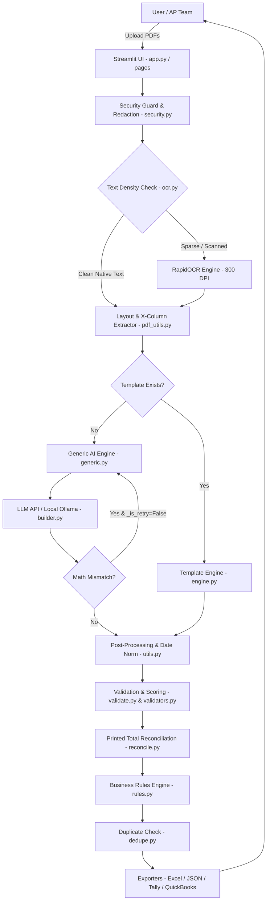
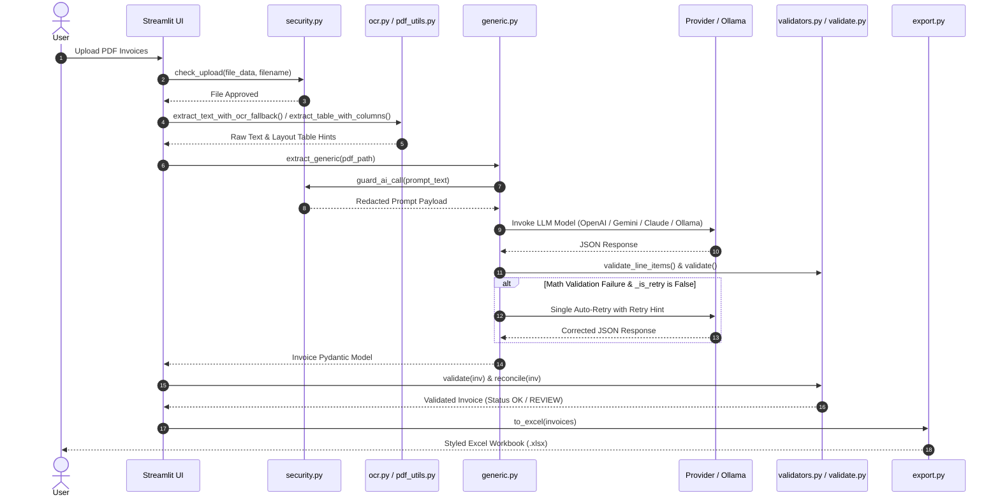

# Project Explanation: Invoice Extractor

## 1. Project Overview
- **Purpose of the Project**: The **Invoice Extractor** is an enterprise-grade, privacy-first invoice processing application designed to automate data extraction from unstructured and semi-structured PDF invoices, bills, and receipts.
- **Problem It Solves**: Manual invoice data entry is slow, prone to human error, expensive, and difficult to scale. Standard OCR tools often produce raw, unstructured text streams where column structures, tax breakdowns (CGST/SGST/IGST), line items, and summary totals get misaligned or lost.
- **Business Use Case**: Enables accounts payable (AP) teams, procurement departments, and financial auditors to upload single or batch PDF invoices, extract line items and header fields with high precision, validate math consistency (Qty × Rate = Taxable Value, Subtotal + Tax = Total), detect duplicates, apply custom business rules, and export verified records directly to Excel, Tally XML, or QuickBooks CSV.
- **High-Level Overview**: The system features a dual-engine architecture:
  1. **Template-Based Engine (`engine.py`)**: Uses deterministic bounding-box coordinates for zero-latency, offline extraction of recurring vendor invoices.
  2. **AI-Powered Generic Engine (`generic.py`)**: Uses multi-provider LLM models (OpenAI, Anthropic Claude, Google Gemini, Groq, Mistral, OpenRouter, or local Ollama) combined with layout-aware X-coordinate table mapping (`pdf_utils.py`) and RapidOCR fallback (`ocr.py`) to process non-standard or unseen invoices without templates.
- **Key Objectives**:
  - Achieve high extraction accuracy (>95%) on both native and scanned multi-page invoices.
  - Provide a zero-cloud-lock-in option via 100% local/on-premise deployment (Ollama + RapidOCR).
  - Guarantee data privacy through strict input sanitization, file hash tracking, and automated secret/PII redaction before sending payloads to external APIs.

---

## 2. Tech Stack

| Technology | Purpose | Where Used |
|------------|----------|------------|
| **Python 3.12** | Primary programming language | Entire codebase (`extractor/`, `app.py`, `pages/`, `tests/`) |
| **Streamlit 1.36+** | Web application framework for UI | `app.py`, `pages/*.py`, `extractor/ui.py` |
| **pdfplumber 0.11+** | PDF text, bounding box coordinates, and word-level layout extraction | `extractor/pdf_utils.py`, `extractor/engine.py`, `extractor/reconcile.py` |
| **PyMuPDF (fitz) 1.24+** | PDF page rendering, resolution scaling (DPI 300), and scanned document detection | `extractor/ocr.py` |
| **RapidOCR (ONNX) 1.2+** | Lightweight local OCR engine for scanned images (runs via ONNX Runtime without Tesseract/CUDA) | `extractor/ocr.py` |
| **OpenAI API / Client** | Interface for OpenAI models (GPT-4o, GPT-4o-mini) and local Ollama OpenAI-compatible endpoints | `extractor/builder.py`, `extractor/generic.py` |
| **Anthropic SDK** | Interface for Anthropic Claude models (Claude 3.5 Sonnet, Claude 3 Haiku) | `extractor/builder.py` |
| **Google Gemini REST API** | Interface for Google Gemini models (Gemini 1.5 Pro, Gemini 1.5 Flash) | `extractor/builder.py` |
| **OpenPyXL 3.1+** | Formatting, styling, and generating multi-tab Excel workbooks | `extractor/export.py` |
| **Pydantic 2.0+** | Data validation, type hints, and structured data contracts | `extractor/models.py` |
| **PyYAML 6.0+** | Parsing vendor templates (`templates/*.yaml`), business rules (`rules.yaml`), and security settings (`security.yaml`) | `extractor/templates.py`, `extractor/rules.py`, `extractor/security.py` |
| **ReportLab 4.0+** | Programmatic PDF generation for synthetic benchmark sample invoices | `scripts/make_sample_invoices.py` |
| **Pytest 9.1+** | Automated unit testing framework | `tests/test_*.py` |
| **GitHub Actions** | Continuous integration runner (Python 3.12 on `ubuntu-latest`) | `.github/workflows/ci.yml` |

---

## 3. Project Structure

```text
invoice-extractor/
├── app.py                      # Main Streamlit dashboard (Template-based batch processing)
├── run.py                      # Application launcher script
├── requirements.txt            # Production Python dependencies
├── requirements-onprem.txt     # On-premise air-gapped dependency specifications
├── rules.yaml                  # Custom business rules configuration
├── security.yaml               # Security parameters, file size limits, and OCR thresholds
├── ARCHITECTURE.md             # Technical architecture documentation
├── ON-PREM.md                  # Deployment guide for local air-gapped environments
├── README.md                   # Project landing documentation with CI status badge
├── SECURITY.md                 # Security & compliance guidelines
├── Start Invoice Tool.bat      # Windows automated launcher script
├── setup_venv312.bat           # Virtual environment initialization script
├── .github/
│   └── workflows/
│       └── ci.yml              # GitHub Actions CI workflow script
├── .streamlit/
│   └── config.toml             # Streamlit server and theme configuration
├── extractor/                  # Core Business & Data Extraction Package
│   ├── __init__.py             # Package exports
│   ├── autotemplate.py         # Visual coordinate box detection for automated template generation
│   ├── builder.py              # Visual click-to-build template builder & LLM API client wrappers
│   ├── classify.py             # Rule-based vendor classification scoring
│   ├── dedupe.py               # History tracking and duplicate invoice detection
│   ├── engine.py               # Deterministic bounding-box PDF extraction engine
│   ├── export.py               # Excel and CSV exporter with cell styling
│   ├── exporters.py            # JSON, QuickBooks CSV, and Tally XML exporters
│   ├── generic.py              # AI-powered generic LLM extraction pipeline with auto-retry
│   ├── models.py               # Pydantic data models (Invoice, LineItem)
│   ├── ocr.py                  # PyMuPDF + RapidOCR fallback engine with 3-tier confidence markers
│   ├── pdf_utils.py            # Layout-aware X-coordinate table & financial summary extraction
│   ├── reconcile.py            # Independent PDF printed total verification
│   ├── rules.py                # Rule engine for field assignments and regex overrides
│   ├── security.py             # File safety verification, secret redaction, and audit logging
│   ├── templates.py            # YAML template loader, saver, and validator
│   ├── ui.py                   # Streamlit custom theme styling and hero banners
│   ├── utils.py                # Shared numeric parsing (_num) and multi-format date normalization
│   ├── validate.py             # Invoice sanity validation and confidence scoring
│   └── validators.py           # Invoice number scoring and Qty x Rate line item math validation
├── pages/                      # Streamlit Multi-Page Interface
│   ├── 1_Extract_Any_Invoice.py # AI Universal Extractor UI
│   ├── 2_Add_New_Vendor.py     # Interactive Template Builder UI
│   ├── 3_Manage.py             # Vendor Templates & Extraction History Management UI
│   ├── 4_Business_Rules.py     # Business Rules Management UI
│   └── 5_Security_and_Logs.py  # Audit Logs & Security Settings UI
├── scripts/
│   └── make_sample_invoices.py # Synthetic sample invoice PDF generator script
├── templates/                  # Vendor YAML Template Storage Directory
│   └── sample_vendor.yaml      # Reference vendor template schema
├── output/                     # Default output directory for generated exports
└── tests/                      # Pytest Automated Test Suite (61 tests)
    ├── __init__.py
    ├── conftest.py             # Pytest fixtures (`sample_invoice`, `minimal_invoice`)
    ├── test_generic.py         # Generic extraction, prompt hints, and score unit tests
    ├── test_num.py             # Numeric parsing (_num) edge-case unit tests
    ├── test_pdf_utils.py       # Layout-aware X-mapping and summary extraction unit tests
    ├── test_reconcile.py       # Reconciliation unit tests
    ├── test_security.py        # Redaction and settings cache unit tests
    ├── test_utils.py           # Date normalization unit tests
    ├── test_validate.py        # Invoice validation unit tests
    └── test_validators.py      # Invoice number scoring & line item math unit tests
```

---

## 4. End-to-End Workflow

```text
User PDF Upload
      ↓
[Security & Validation Check] (`extractor/security.py`)
      ↓
[PDF Text & OCR Processing] (`extractor/ocr.py` & `extractor/pdf_utils.py`)
      ↓
[Extraction Path Selection]
  ├── Path A: Template Engine (`extractor/engine.py` & `extractor/classify.py`)
  └── Path B: Generic AI Engine (`extractor/generic.py` & `extractor/pdf_utils.py`)
      ↓
[Post-Processing & Validation Pipeline]
  ├── Date Normalization (`extractor/utils.py`)
  ├── Field & Math Validation (`extractor/validate.py` & `extractor/validators.py`)
  ├── Document Reconciliation (`extractor/reconcile.py`)
  └── Business Rules Application (`extractor/rules.py`)
      ↓
[Duplicate Check & Audit Logging] (`extractor/dedupe.py` & `extractor/security.py`)
      ↓
[Export Generation] (`extractor/export.py` & `extractor/exporters.py`)
```

### Detailed Workflow Steps:
1. **User PDF Upload**: The user uploads one or more PDF files via `app.py` or `pages/1_Extract_Any_Invoice.py`.
2. **Security Check**: `check_upload()` in `extractor/security.py` verifies that file sizes stay within limits (default 15MB), checks extensions (`.pdf`), and computes a SHA-256 hash.
3. **OCR / Text Pre-processing**: PyMuPDF (`fitz`) inspects page character density. If clean text is present, native text is extracted. If text count is below `min_chars_per_page` (default 50), RapidOCR renders pages at 300 DPI and extracts text with 3-tier confidence markers (`[?text?]` for 0.4–0.5 conf, `[??text??]` for <0.4 conf).
4. **Extraction Routing**:
   - **Template Mode (`app.py`)**: `detect_vendor()` in `extractor/classify.py` scores keywords against saved YAML templates. If a match is found, `engine.py` extracts text using exact bounding boxes.
   - **AI Universal Mode (`pages/1_Extract_Any_Invoice.py`)**: `generic.py` triggers `extract_table_with_columns()` and `extract_financial_summary()` in `pdf_utils.py` to build structured Markdown table hints, redacting API keys via `guard_ai_call()`, and sends the prompt to the selected LLM provider.
5. **Post-Processing & Validation**:
   - `_normalize_date()` converts dates across 11 formats into standard `YYYY-MM-DD`.
   - `validate_invoice_number()` flags phone numbers or non-invoice strings.
   - `validate_line_items()` checks `Qty × Rate ≈ Taxable Value` with a 2% tolerance.
   - `validate()` evaluates total equation consistency (`Subtotal + Tax = Total`). If math validation fails in `generic.py`, a single targeted auto-retry is executed with a retry hint.
   - `reconcile()` verifies extracted printed totals against raw page text.
   - `apply_rules()` executes custom regex and field overrides defined in `rules.yaml`.
6. **Duplicate Check & Export**: `check_duplicates()` flags duplicate invoices by comparing `(vendor, invoice_number, invoice_date, total)` tuples or SHA-256 hashes against `output/history.csv`. Data is exported to multi-sheet formatted Excel (`.xlsx`), JSON, QuickBooks CSV, or Tally XML.

---

## 5. Module Breakdown

### `app.py`
- **Purpose**: Main Streamlit dashboard for template-based batch invoice processing.
- **Responsibilities**: Handles multi-file PDF upload, vendor auto-detection, batch extraction progress bar, duplicate checks, review/edit table UI, and export triggers.
- **Inputs**: Uploaded PDF file buffers, vendor selection dropdown.
- **Outputs**: Displayed dataframes, session state updates, Excel/Tally/QuickBooks file downloads.

### `pages/1_Extract_Any_Invoice.py`
- **Purpose**: AI Universal Extractor UI for processing unstructured invoices without templates.
- **Responsibilities**: Provides LLM provider selection (OpenAI, Anthropic, Gemini, Groq, Ollama), model overrides, custom prompts, line item previews, reconciliation status, and export buttons.

### `pages/2_Add_New_Vendor.py`
- **Purpose**: Interactive visual template builder interface.
- **Responsibilities**: Renders PDF pages as images, allows users to click coordinates or auto-detect bounding boxes using `autotemplate.py`, tests extraction, and saves vendor templates to `templates/*.yaml`.

### `pages/3_Manage.py`
- **Purpose**: Vendor template and extraction history management interface.
- **Responsibilities**: Allows viewing, deleting, and editing saved YAML vendor templates and clearing extraction history logs.

### `pages/4_Business_Rules.py`
- **Purpose**: UI for viewing and editing conditional business rules.
- **Responsibilities**: Provides a code editor for `rules.yaml` with syntax validation and live testing against sample invoices.

### `pages/5_Security_and_Logs.py`
- **Purpose**: UI for viewing audit logs and managing runtime security settings.
- **Responsibilities**: Displays `output/audit_log.csv`, allows editing security parameters (`security.yaml`), and testing secret redaction filters.

### `extractor/models.py`
- **Purpose**: Pydantic data contracts for invoices and line items.
- **Main Classes**:
  - `LineItem`: Fields for `description`, `hsn_sac`, `quantity`, `unit_price`, `tax_rate`, `tax_amount`, `amount`.
  - `Invoice`: Fields for `vendor`, `invoice_number`, `invoice_date`, `po_number`, `currency`, `subtotal`, `cgst`, `sgst`, `igst`, `taxable_value`, `tax`, `total`, `confidence`, `status`, `reconciliation`, `ocr_used`, `line_items`, `taxes`, `extra`. Includes `to_dict()` and `to_flat_rows()` export helpers.

### `extractor/pdf_utils.py`
- **Purpose**: Layout-aware table column extraction and financial summary parsing.
- **Main Functions**:
  - `extract_table_with_columns(pdf_path)`: Uses bounding box X-coordinates to map line items to header columns, persisting `carried_col_map` across multi-page tables.
  - `extract_financial_summary(pdf_path)`: Scans document footers for labeled summary amounts (`subtotal`, `cgst`, `sgst`, `igst`, `total_tax`, `round_off`, `grand_total`, `discount`).
  - `_merge_multiline_rows()`: Combines multi-line item descriptions.
  - `_fix_hsn_in_rows()`: Rescues misplaced 4–8 digit HSN codes.
  - `_fix_exempt_rows()`: Sets GST rates/amounts to `0` for exempt/nil-rated lines.

### `extractor/generic.py`
- **Purpose**: Multi-provider LLM extraction engine with validation and auto-retry.
- **Main Functions**:
  - `extract_generic(pdf_path, provider, model, ...)`: Coordinates prompt generation, layout table hints, LLM invocation, post-processing, and single auto-retry on math validation failure (`_has_math_failure()`).
  - `_strip_ocr_markers()`: Removes OCR confidence brackets (`[?text?]`) from string fields.

### `extractor/ocr.py`
- **Purpose**: PDF page text rendering and local OCR fallback.
- **Main Functions**:
  - `extract_text_with_ocr_fallback(pdf_path)`: Renders PDF pages via PyMuPDF at 300 DPI and extracts text using RapidOCR when native text is sparse. Implements 3-tier confidence tagging.

### `extractor/security.py`
- **Purpose**: Data protection, input validation, secret redaction, and audit logging.
- **Main Functions**:
  - `check_upload()`: Validates file extensions, size limits, and binary signatures.
  - `scrub_secrets(text)`: Redacts API keys (`sk-`, `AIza`, Bearer tokens) using `_SECRET_RE`.
  - `load_settings()`: Reads `security.yaml` with a 60-second TTL cache (`_settings_cache`).
  - `log_event()`: Writes audit events to `output/audit_log.csv`.

### `extractor/validators.py`
- **Purpose**: Low-level field confidence scoring and line item math validation.
- **Main Functions**:
  - `validate_invoice_number(value)`: Scores invoice numbers (rejecting phone numbers starting with 6–9 and 10+ digits).
  - `validate_line_items(rows)`: Validates `Qty × Rate ≈ Taxable Value` with 2% tolerance.

### `extractor/validate.py`
- **Purpose**: Document-level math consistency validation and status assignment.
- **Main Functions**:
  - `validate(inv)`: Checks equation `Subtotal + Tax = Total`, flags missing required fields, and assigns status (`OK`, `REVIEW`, `MISSING_FIELDS`).

### `extractor/reconcile.py`
- **Purpose**: Independent printed total reconciliation.
- **Main Functions**:
  - `reconcile(inv, pdf_path)`: Searches raw text for printed currency numbers and compares them against `inv.total`.

### `extractor/export.py` & `extractor/exporters.py`
- **Purpose**: File generation for external systems.
- **Main Functions**: `to_excel()`, `to_csv()`, `to_json()`, `to_quickbooks_csv()`, `to_tally_xml()`.

---

## 6. Core Business Logic

### Pipeline Execution Architecture:
1. **Extraction Routing**: Auto-detects vendor via `classify.py` or routes to generic LLM engine (`generic.py`).
2. **Table Reconstruction**: Rebuilds tables using X-coordinates (`pdf_utils.py`) to avoid column transposition errors.
3. **Data Normalization**: Converts dates into `YYYY-MM-DD` and cleans numeric strings into floats (`utils.py`).
4. **Equation Verification**: Validates `Subtotal + Tax = Total` and `Qty × Rate = Taxable Value`.
5. **Rules Application**: Applies vendor-specific or global field mappings and text replacements (`rules.py`).
6. **Reconciliation & Status Rating**: Assigns status `OK` (high confidence) or `REVIEW` (math mismatch, missing fields, or low confidence).

---

## 7. AI / OCR Pipeline

```text
[PDF Input]
    ↓
[PyMuPDF Text Density Check] (`extractor/ocr.py`)
    ├── Clean Native Text → Extract directly
    └── Sparse / Scanned → RapidOCR (300 DPI)
            ↓
      [Confidence Tagging]
        ├── Conf >= 0.5 → Accept as-is
        ├── 0.4 <= Conf < 0.5 → Tag [?text?]
        └── Conf < 0.4 → Tag [??text??]
            ↓
[Layout & Column Mapping] (`extractor/pdf_utils.py`)
    ├── X-coordinate Header Detection (`extract_table_with_columns`)
    ├── Multi-page Map Continuation (`carried_col_map`)
    └── Financial Summary Parsing (`extract_financial_summary`)
            ↓
[Prompt Assembly & Guardrails] (`extractor/generic.py` & `extractor/security.py`)
    ├── API Key Redaction (`scrub_secrets`)
    └── Structured Table & Financial Hints Injection
            ↓
[LLM Provider Invocation] (`extractor/builder.py`)
    ├── OpenAI / Anthropic / Gemini / Groq / Ollama
            ↓
[Response Parsing & Math Verification]
    ├── Failure Detected → Single Auto-Retry with Retry Hint
    └── Success → Clean OCR Markers & Pass to Validator
```

---

## 8. Data Processing Logic

- **Parsing**: `pdfplumber` extracts word dictionaries with bounding boxes `(x0, top, x1, bottom)`.
- **Cleaning**: `_num()` strips currency symbols (`₹`, `$`, `€`), commas, and whitespace. `_normalize_date()` parses 11 date formats (`YYYY-MM-DD`, `DD/MM/YYYY`, `DD-MMM-YYYY`, etc.).
- **Validation**: Checks invoice number format, Qty × Rate row math, and total sum integrity.
- **Mapping**: Maps extracted dictionary keys to `Invoice` and `LineItem` Pydantic models.
- **Formatting & Output**: Generates styled Excel workbooks (`export.py`) with summary tabs, invoice details, confidence highlights, Tally-compatible XML, and QuickBooks CSV.

---

## 9. Configuration

- **`security.yaml`**: Controls `max_file_size_mb` (15), `allowed_extensions` (`.pdf`), `log_audit_events` (true), `min_ocr_confidence` (0.5), `ocr_dpi` (300).
- **`rules.yaml`**: Configures global and vendor-specific field assignments, default values, and regex search-and-replace rules.
- **`templates/*.yaml`**: Stores bounding-box extraction rules per vendor (e.g., `vendor_name`, `keywords`, `fields`, `table` column definitions).
- **`.streamlit/config.toml`**: Configures Streamlit server settings (port 8501, maximum upload size 200MB) and visual theme colors.

---

## 10. External Integrations

- **OpenAI API**: Uses `openai` SDK to call `gpt-4o` and `gpt-4o-mini`. Handles API key auth and JSON mode.
- **Anthropic API**: Uses `anthropic` SDK to call `claude-3-5-sonnet` and `claude-3-haiku`.
- **Google Gemini REST API**: Direct HTTP requests to `generativelanguage.googleapis.com` for `gemini-1.5-pro` and `gemini-1.5-flash`.
- **Local Ollama Endpoint**: Uses `openai` SDK pointed to `http://localhost:11434/v1` for 100% offline open-source models (e.g., `qwen2.5:14b-instruct`).

---

## 11. Error Handling

- **Validation Errors**: Low confidence fields or math mismatches do not crash the app; they flag the invoice status as `REVIEW` or `MISSING_FIELDS`.
- **API Failure & Retry**: `extract_generic()` catches JSON parsing or math validation errors and executes a single targeted auto-retry with hint feedback (`_build_retry_hint()`).
- **OCR Failures**: Encrypted or corrupted PDFs close handles cleanly (`doc.close()`) and return `ocr_used = False` without crashing.
- **Audit Logging**: All exceptions and rejected uploads are logged to `output/audit_log.csv` via `log_event()`.

---

## 12. Performance Considerations

- **TTL Settings Cache**: `load_settings()` caches `security.yaml` in `_settings_cache` with a 60-second TTL using `time.monotonic()`, eliminated repeated disk reads.
- **Single-Pass PDF Reads**: `extract_generic()` reuses `row_hint` and extracted text, preventing double PDF parsing.
- **Efficient OCR Execution**: RapidOCR runs ONNX runtime CPU inference only when native text character count drops below threshold (`min_chars_per_page = 50`).

---

## 13. Security Considerations

- **Secret Redaction**: `scrub_secrets()` in `extractor/security.py` redacts OpenAI keys (`sk-`), Gemini keys (`AIza`), Bearer tokens, and generic API keys from prompts and log messages.
- **Input Sanitization**: File uploads are checked for extensions, file size limits, and binary signatures. File names are sanitized with `safe_filename()`.
- **Local Privacy Option**: Supports 100% air-gapped on-premise execution via Ollama and local RapidOCR, guaranteeing zero outbound data transfer.

---

## 14. Design Decisions

- **Dual Engine Architecture**: Combines zero-latency deterministic templates for recurring vendors with flexible LLMs for novel invoices.
- **Layout-Aware X-Coordinate Mapping**: Solves text flow column transposition errors by anchoring text to header X-coordinates instead of raw text line reading.
- **Pydantic Data Contracts**: Guarantees strict type safety and schema validation across all pipeline stages.

---

## 15. Recent Improvements

- **Summary Row Filtering Expansion**: Enhanced regex filtering in `generic.py` (`_TOTAL_ROW_PATTERNS`) to exclude totals, tax lines, and round-offs from line item arrays.
- **3-Tier OCR Markers**: Introduced `[?text?]` (0.4–0.5 conf) and `[??text??]` (<0.4 conf) confidence markers in `ocr.py` with automatic post-processing cleanup.
- **Cross-Field Math Auto-Retry**: Added single auto-retry in `generic.py` guarded by `_is_retry=False` when `validate()` detects math mismatches.
- **Layout-Aware Column Extraction & Continuation**: Implemented X-coordinate column anchor mapping and multi-page `carried_col_map` persistence in `pdf_utils.py`.
- **Financial Summary Footer Parsing**: Implemented direct footer summary parsing in `pdf_utils.py` to extract taxable value, taxes, and grand totals directly.
- **Field Hardening & Math Validation**: Created `validators.py` for phone-number rejection in invoice numbers and 2% tolerance Qty × Rate line item math checks.
- **Test Suite & CI Pipeline**: Established 61 automated Pytest unit tests in `tests/` and a GitHub Actions workflow in `.github/workflows/ci.yml`.

---

## 16. Known Limitations

- **Handwritten Text**: Scanned handwritten invoices may receive low OCR confidence scores.
- **Non-PDF Inputs**: The application currently accepts PDF files only (JPEG/PNG must be embedded in a PDF container).
- **Complex Nested Tables**: Nested inner tables inside single table cells may require template bounding-box extraction.

---

## 17. Future Improvements

- **Native Image Input Support**: Direct processing for standalone PNG, JPEG, and TIFF files.
- **Automated Template Learning**: Auto-generating YAML templates from validated AI extractions to reduce API costs over time.
- **Webhook Integration**: Real-time HTTP webhook notifications upon batch extraction completion.

---

## 18. Code Walkthrough

During a technical demo, walk through the codebase in this order:
1. `extractor/models.py`: Show the data structure (`Invoice`, `LineItem`).
2. `extractor/pdf_utils.py`: Explain layout-aware X-coordinate table column mapping and financial summary parsing.
3. `extractor/ocr.py`: Show PyMuPDF text check, RapidOCR fallback, and 3-tier confidence markers.
4. `extractor/generic.py`: Explain prompt assembly, security redaction, and auto-retry logic.
5. `extractor/validators.py` & `validate.py`: Show line item math validation and invoice scoring.
6. `app.py` & `pages/1_Extract_Any_Invoice.py`: Demonstrate the Streamlit UI dashboard and live batch extraction.

---

## 19. Live Demo Walkthrough

### Script for Presentation:
- **Opening**: "Good morning/afternoon. Today I'm demonstrating the Invoice Extractor, an enterprise solution designed to automate invoice processing using a hybrid template and AI architecture."
- **Problem & Solution**: "Unstructured invoice PDFs often cause OCR column shifting and tax calculation errors. Our system combines bounding-box template extraction with layout-aware LLM processing."
- **Live Execution**:
  1. Open `app.py` and upload a batch of PDF invoices.
  2. Demonstrate auto-vendor detection and deterministic template extraction.
  3. Navigate to **Extract Any Invoice** (`pages/1_Extract_Any_Invoice.py`) and upload an unseen invoice.
  4. Show how the AI engine extracts line items, reconciles totals, and flags confidence status.
  5. Export verified data to Excel, Tally XML, and QuickBooks CSV.
- **Closing**: "In summary, the tool delivers high extraction accuracy, math validation, secret redaction, and full support for local air-gapped deployments."

---

## 20. Architecture Diagram



---

## 21. Sequence Diagram



---

## 22. Frequently Asked Questions

1. **Why was a dual-engine architecture chosen?**
   Template extraction provides zero-cost, zero-latency deterministic extraction for recurring vendors, while the generic AI engine handles novel or unstructured invoices seamlessly.
2. **How does the system handle scanned PDF invoices?**
   PyMuPDF inspects page character counts. If native text is below threshold (`min_chars_per_page = 50`), RapidOCR renders the document at 300 DPI and extracts text with 3-tier confidence tagging.
3. **How are API keys and sensitive PII protected?**
   `scrub_secrets()` in `security.py` redacts OpenAI, Gemini, and Bearer tokens via regular expressions before sending prompts to LLM endpoints.
4. **Can this tool run completely offline without cloud dependencies?**
   Yes. By pairing local RapidOCR with a local Ollama server running `qwen2.5:14b-instruct`, the application operates 100% on-premise with zero outbound network traffic.
5. **How does layout-aware table extraction work?**
   `extract_table_with_columns()` in `pdf_utils.py` uses word-level X-coordinates to anchor cell values to header columns, preventing text flow column transposition.
6. **How are multi-page tables handled?**
   `extract_table_with_columns()` persists `carried_col_map` across pages, ensuring table rows on page 2+ are correctly mapped even if page 2 lacks a header row.
7. **How does the system extract financial totals accurately?**
   `extract_financial_summary()` scans document footers for labeled summary blocks (`Subtotal`, `CGST`, `SGST`, `IGST`, `Grand Total`) and feeds these values directly to the parser.
8. **What happens if line item math (`Qty × Rate`) is incorrect?**
   `validate_line_items()` checks for deviations exceeding 2%. If detected, `generic.py` logs the mismatch and executes a single auto-retry with a targeted hint.
9. **How are date formats standardized?**
   `_normalize_date()` in `utils.py` parses 11 common date formats (e.g. `20-Jul-26`, `20/07/2026`) into standardized `YYYY-MM-DD` strings.
10. **How does the system prevent extracting duplicate invoices?**
    `check_duplicates()` in `dedupe.py` compares SHA-256 file hashes and `(vendor, invoice_number, invoice_date, total)` tuples against `output/history.csv`.
11. **How are tax components (CGST/SGST/IGST) handled?**
    The `Invoice` model contains dedicated fields for `cgst`, `sgst`, and `igst`. Post-processing automatically sums CGST + SGST + IGST into `inv.tax` if missing.
12. **How is data exported for accounting software?**
    The application includes dedicated exporters in `exporters.py` for Tally XML import and QuickBooks CSV format, in addition to Excel (`.xlsx`) and JSON.
13. **How is the application tested?**
    The codebase includes a Pytest test suite with 61 unit tests covering numeric parsing, date normalization, layout extraction, reconciliation, and security redaction.
14. **How is CI/CD configured?**
    A GitHub Actions workflow in `.github/workflows/ci.yml` automatically runs the Pytest suite on every push and pull request using Python 3.12 on `ubuntu-latest`.
15. **What file formats are supported for upload?**
    The application accepts PDF documents (`.pdf`). File uploads are validated for size limits, file extension, and binary header integrity.
16. **How does the interactive template builder work?**
    `pages/2_Add_New_Vendor.py` renders PDF pages as images, enabling users to click bounding-box coordinates or auto-detect tables using `autotemplate.py`.
17. **How are business rules applied?**
    `apply_rules()` in `rules.py` evaluates YAML rules (`rules.yaml`) to apply conditional field assignments, default values, and regex search-and-replace rules.
18. **How does reconciliation work?**
    `reconcile()` in `reconcile.py` independently parses raw PDF text for printed monetary amounts and compares them against `inv.total`.
19. **What is the settings caching mechanism?**
    `load_settings()` in `security.py` caches `security.yaml` in memory with a 60-second TTL (`_settings_cache`), avoiding redundant disk reads.
20. **What is the license and enterprise readiness of the tool?**
    Built with modular, decoupled architecture, Pydantic type safety, audit logging, and zero-hardcoded secrets, making it enterprise-ready for on-premise or cloud AP automation.

---

## 23. Key Takeaways

- **Dual Engine Flexibility**: Seamlessly combines zero-cost deterministic templates with multi-provider LLM AI extractions.
- **Layout-Aware Precision**: Uses X-coordinate bounding box anchors to eliminate column transposition errors in unstructured PDFs.
- **Financial Summary Footer Parsing**: Extracts taxable value, tax components, and grand totals directly from invoice footers.
- **Multi-Page Table Support**: Persists column mappings across multi-page documents without losing continuation rows.
- **Automated Math Validation**: Checks `Qty × Rate = Taxable Value` and `Subtotal + Tax = Total` with automatic single retry on failure.
- **100% Air-Gapped Option**: Fully functional in local, privacy-first environments via RapidOCR and Ollama.
- **Automated Secret Redaction**: Intercepts and masks API keys and sensitive tokens before external API calls.
- **Multi-Format Exporting**: Generates styled Excel workbooks, JSON, QuickBooks CSV, and Tally XML.
- **Enterprise Security & Audit**: Features file validation, hash tracking, 60s TTL settings caching, and CSV audit logging.
- **Robust Test Coverage**: Backed by a 61-test Pytest suite and GitHub Actions CI workflow on Python 3.12.
